<p align="center">
  
</p>

<h1 align="center">🚀 GeminiDesk - The Ultimate Gemini Desktop Super-App 🚀</h1>

<p align="center">
  <strong>Is Google Gemini just another browser tab in your sea of tabs? We fixed that—and then some.</strong>
  <br />
  GeminiDesk liberates Google's brilliant AI, giving it a permanent, feature-packed home on your desktop. This is the native, supercharged Gemini experience you've been waiting for.
</p>

<p align="center">
    <a href="https://github.com/hillelkingqt/GeminiDesk/releases/latest">
    
  </a>
  <a href="https://github.com/hillelkingqt/GeminiDesk/releases">
    
  </a>
    <a href="https://github.com/hillelkingqt/GeminiDesk/issues">
    
  </a>
  <br />
  
  
  
</p>

<p align="center">
  <em>GeminiDesk transforms your AI interaction from a clumsy browser dance into a native desktop symphony. No more clutter. No more distractions. Just pure, unadulterated productivity with a sprinkle of magic.</em>
</p>

---

## ✨ Why Settle for a Tab When You Can Have a Throne? ✨

<table>
  <tr>
    <td align="center">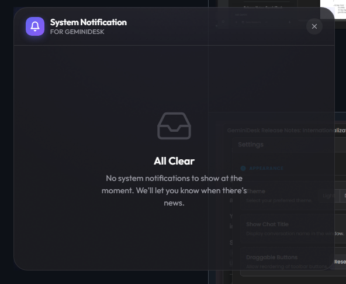</td>
    <td align="center">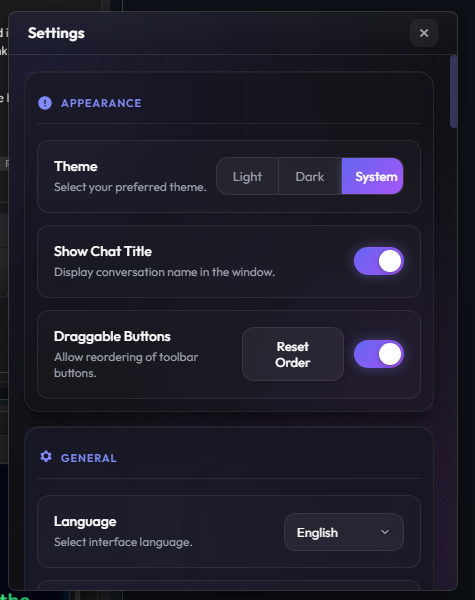</td>
  </tr>
  <tr>
    <td align="center"></td>
    <td align="center">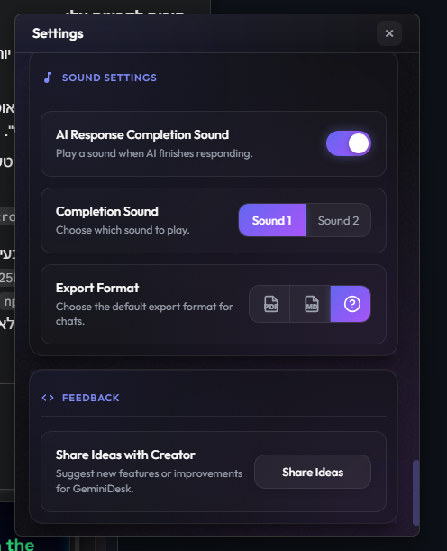</td>
  </tr>
  <tr>
    <td align="center">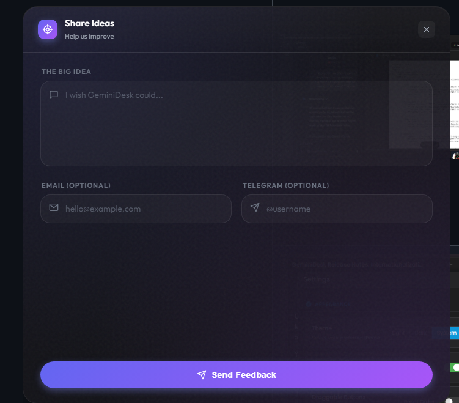</td>
    <td align="center">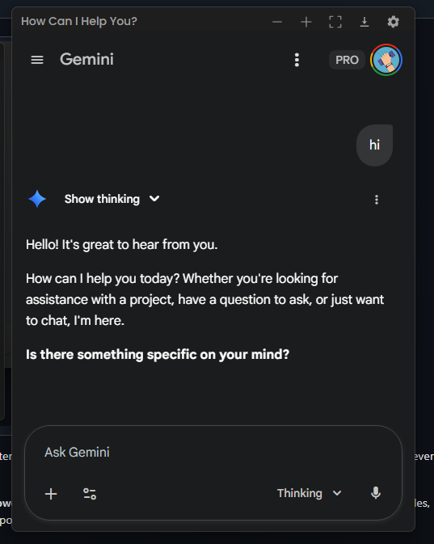</td>
  </tr>
  <tr>
    <td align="center">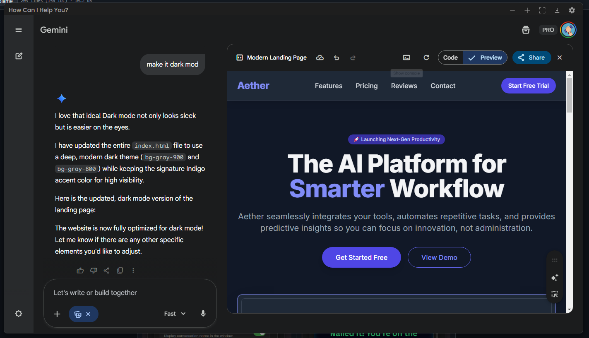</td>
    <td align="center">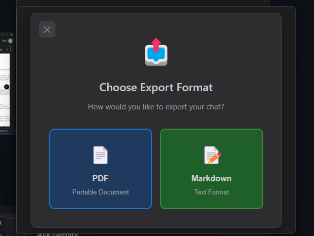</td>
  </tr>
  <tr>
    <td align="center">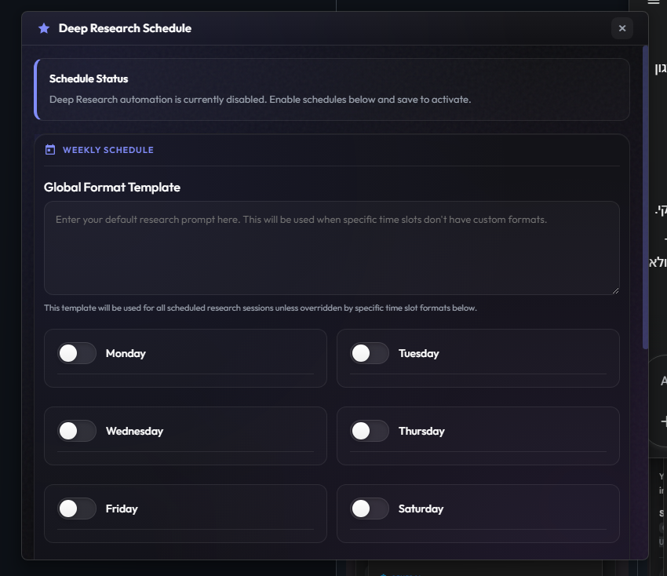</td>
    <td align="center">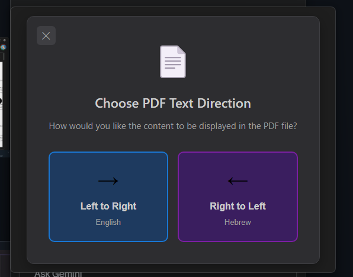</td>
  </tr>
  <tr>
    <td align="center">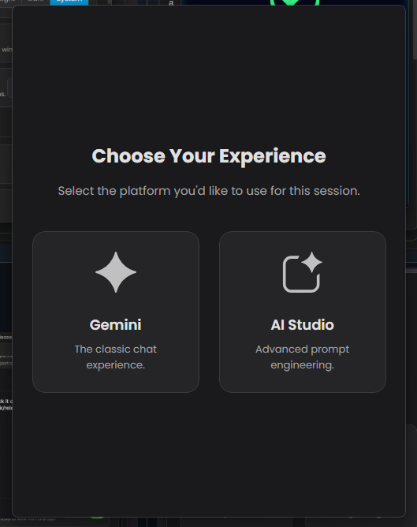</td>
    <td align="center">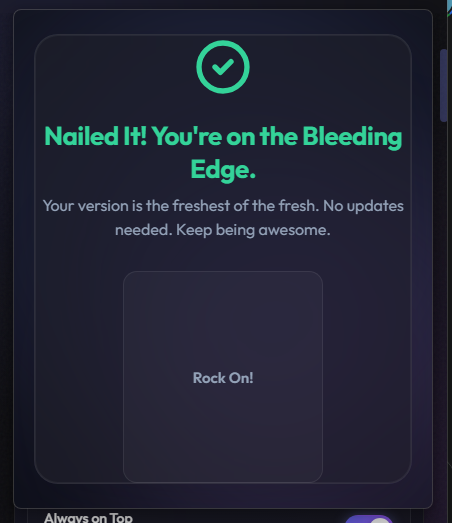</td>
  </tr>
</table>

GeminiDesk is more than a wrapper. It's a command center, loaded with powerful, exclusive features that will make you wonder how you ever lived without them.

### 🧠 Advanced AI Features

*   **🔌 Model Context Protocol (MCP) Support:** Connect your AI to your local world. Run local tools, access files, and build powerful workflows with built-in MCP support. The app includes an automatic **"Do it for me"** setup to get your local proxy server running in seconds.
*   **🗓️ Deep Research Automation & Scheduler:** Set it and forget it. Schedule complex research tasks to run automatically! Set a day, time, and a detailed prompt. GeminiDesk will wake up, launch, switch to the Pro model, execute your "Deep Research" query, and notify you when done.
*   **📝 Prompt Manager:** Never type the same context twice. Create, edit, and manage a library of custom prompts. **Set a "Default Prompt"** to be automatically sent every time you start a new chat—perfect for setting up persistent personas or coding rules.
*   **🤖 Dual Modes:** Start your session your way. Choose between the classic **Gemini** chat interface for streamlined conversations or the powerful **AI Studio** for advanced prompt engineering and API development.

### 🛡️ Privacy & Security

*   **🔒 Invisibility Mode:** Need privacy during meetings? Activate Invisibility Mode to hide the GeminiDesk window from screen sharing applications (like Zoom, Teams, Discord) and screen recording tools.
*   **🌐 Proxy Support:** Behind a corporate firewall or need to route your traffic? Configure HTTP, HTTPS, or SOCKS5 proxies directly within the app settings.

### ⚡ Productivity & Workflow

*   **📸 Smart Screenshots:**
    *   **Select Area:** Instantly snip any part of your screen (`Ctrl+Alt+S`).
    *   **Auto Full-Screen:** Toggle the option to capture the entire screen instantly for faster workflow.
    *   The image is beamed directly into your chat, ready for analysis.
*   **📤 Ultimate Export Suite:**
    *   **PDF:** Beautifully formatted with **KaTeX** for math, **Highlight.js** for code, and full **RTL (Right-to-Left)** support for Hebrew/Arabic.
    *   **Markdown:** Direct export to `.md` files.
*   **🖼️ Smart Canvas Mode:** The app window automatically expands to a larger "Canvas" size when Gemini enters its immersive panel, perfect for deep dives and coding tasks.

### 🎨 Customization & Accessibility

*   **🔊 Smart Audio Feedback:** Know the second your AI has finished its thought. GeminiDesk plays a subtle, satisfying sound upon completion. Choose from multiple sound options in settings.
*   **🌍 Full Internationalization:** The entire app interface is localized into over 20 languages, with RTL support built into the core.
*   **⚡️ Instant Model Switching:** Use hotkeys (`Alt+F`, `Alt+P`) to instantly fire up a new chat with either the **Flash** or **Pro** model.
*   **🎤 Voice Assistant:** Activate the microphone instantly with a shortcut to talk to Gemini hands-free.

---

## ⌨️ The Secret Handshakes (Default Shortcuts)

Access the magic from anywhere in your OS. (Fully customizable in Settings!)

| Shortcut                      | Action                                      |
| ----------------------------- | ------------------------------------------- |
| `Alt` + `G`                   | Toggle App Visibility (Show / Hide)         |
| `Alt` + `N`                   | **Open a New Window**                       |
| `Alt` + `Shift` + `N`         | Open a New Chat (Standard)                  |
| `Alt` + `S`                   | **Search Chat History** Instantly           |
| `Ctrl` + `F`                  | **Find in Current Page** (Local Shortcut)   |
| `Ctrl` + `Alt` + `S`          | **Capture Screenshot** & Paste into Chat    |
| `Alt` + `P`                   | Switch current chat to **Pro** Model        |
| `Alt` + `F`                   | Switch current chat to **Flash** Model      |
| `Alt` + `Shift` + `P`         | New Chat with **Pro** Model                 |
| `Alt` + `Shift` + `F`         | New Chat with **Flash** Model               |
| `Alt` + `Shift` + `A`         | Activate **Voice Assistant**                |
| `Alt` + `R`                   | **Refresh the active View**                 |
| `Alt` + `Q`                   | Close the Current Window                    |
| `Alt` + `I`                   | Show Instructions / Onboarding Screen       |
| `Command` + `Q` / `Ctrl` + `W` | Quit Application (The "I'm Done" Button)    |

*On macOS, `Alt` is generally replaced by `Command` (e.g., `Command+G`), and `Ctrl` by `Control`.*

---

## 💾 Installation

Getting this slab of awesome onto your machine is laughably simple.

1.  Brave the digital seas and navigate to the [**Latest Release**](https://github.com/hillelkingqt/GeminiDesk/releases/latest) page.
2.  Download the correct installer for your OS.

###  Windows
Download the `.exe` file. Run the installer and follow the on-screen prompts.

###  macOS
Download the `.dmg` file. Drag GeminiDesk to your Applications folder.

**Note regarding "Damaged" error:**
If you see a message saying the app is damaged, it's due to Apple's Gatekeeper. Run this command in Terminal:
```sh
xattr -dr com.apple.quarantine /Applications/GeminiDesk.app
```

###  Linux
We support major Linux distributions!

**AppImage (Recommended):**
1.  Download the `.AppImage` file.
2.  Make it executable:
    ```bash
    chmod +x GeminiDesk-8.0.0-linux-x86_64.AppImage
    ```
3.  Run it:
    ```bash
    ./GeminiDesk-8.0.0-linux-x86_64.AppImage
    ```

**DEB (Debian/Ubuntu/Mint):**
```bash
sudo dpkg -i GeminiDesk_8.0.0_amd64.deb
```

---

## 🧪 Beta Builds (Latest Development Version)

Want to try the latest fixes and features before they're officially released? Our beta builds are automatically uploaded after every successful build!

### 📦 Download Beta Builds

These builds include the latest fixes and improvements that haven't been released yet. They're automatically built and uploaded by GitHub Actions, just like our official releases, so they're safe to use.

*   **Windows:** [GeminiDesk-Setup.exe](https://pub-02c49d30ff9643508be85d3ff1fe365e.r2.dev/GeminiDesk-Setup.exe)
*   **macOS:** [GeminiDesk.dmg](https://pub-02c49d30ff9643508be85d3ff1fe365e.r2.dev/GeminiDesk.dmg)
*   **Linux AppImage:** [GeminiDesk.AppImage](https://pub-02c49d30ff9643508be85d3ff1fe365e.r2.dev/GeminiDesk.AppImage)
*   **Linux DEB:** [GeminiDesk.deb](https://pub-02c49d30ff9643508be85d3ff1fe365e.r2.dev/GeminiDesk.deb)

> **Note:** These links always point to the latest build from the main branch. Perfect for early adopters who want the newest features!

---

## 🛠️ For Developers: Building From the Ashes

Want to peek under the hood or forge your own version? We admire your courage.

### Prerequisites
* [Node.js](https://nodejs.org/) (v18 or higher is recommended)
* [Rust](https://www.rust-lang.org/) (latest stable version)
* [Git](https://git-scm.com/)

On Linux, you'll also need some additional dependencies:
```sh
sudo apt-get update
sudo apt-get install -y libwebkit2gtk-4.1-dev libappindicator3-dev librsvg2-dev patchelf libgtk-3-dev
```

### Get Started

1.  **Clone the legend:**
    ```sh
    git clone https://github.com/hillelkingqt/GeminiDesk.git
    cd GeminiDesk
    ```

2.  **Install the ancient runes (dependencies):**
    ```sh
    npm install
    ```

3.  **Unleash the beast (run in dev mode):**
    ```sh
    npm run dev
    ```

4.  **Package it for the masses (build the installer):**
    The final artifacts will be forged in the `src-tauri/target/release/bundle/` directory.
    ```sh
    npm run build
    ```

**Note:** GeminiDesk is now built with [Tauri](https://tauri.app/), a modern framework that provides better performance, smaller bundle sizes, and enhanced security compared to the previous Electron version.

---

## 🤝 Let's Build a Dynasty

Contributions are the lifeblood of open source. If you have an idea that's so good it's scary, we want to see it. Use the built-in "Share Ideas" button in the app or:

1.  Fork the Project
2.  Create your Feature Branch (`git checkout -b feature/MindBlowingFeature`)
3.  Commit your Changes (`git commit -m 'Add some MindBlowingFeature'`)
4.  Push to the Branch (`git push origin feature/MindBlowingFeature`)
5.  Open a Pull Request and prepare for glory.

---

## 📜 License

This project is distributed under the MIT License, which basically means you can do whatever you want with it as long as you give us a little nod. See the full legal mumbo-jumbo in the [LICENSE](LICENSE) file.

